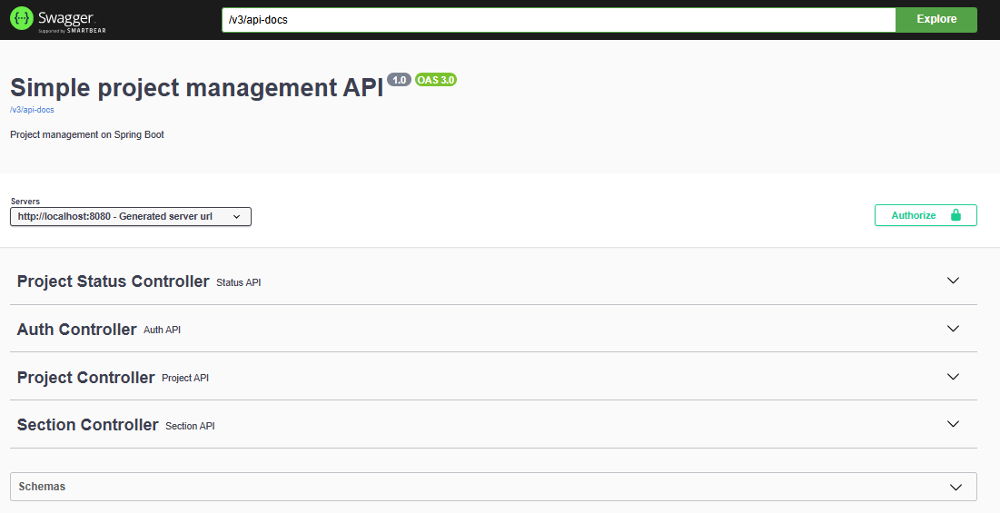
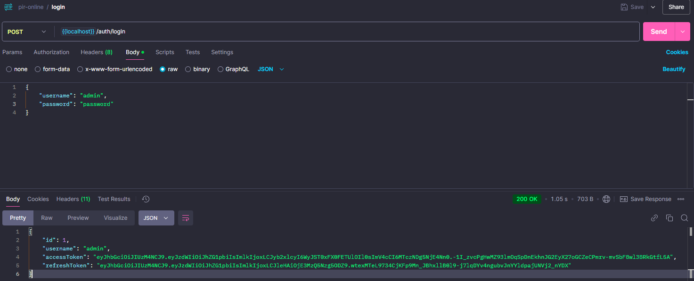
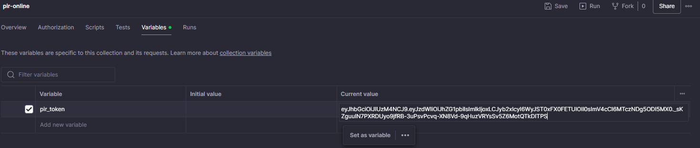
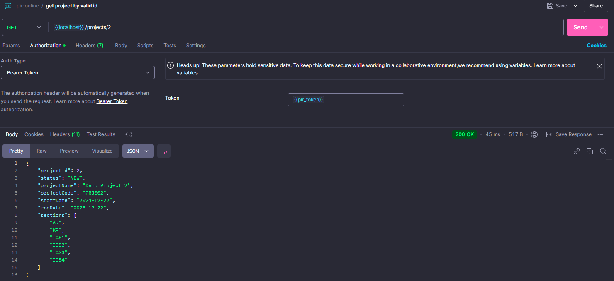

# REST API для управления проектом

Этот проект представляет собой REST API, которое позволяет пользователям управлять жизненным циклом проекта, включая:

- Добавление проекта
- Удаление проекта
- Обновление проекта
- Получение информации о проекте

Каждый проект имеет карточку проекта, содержащую ключевую информацию:

- **Название проекта**
- **Шифр проекта**
- **Дата начала проекта**
- **Дата окончания проекта**

### Статус проекта:
Проект может иметь один из следующих статусов:
- **В работе**
- **Удален**
- **Новый**

### Разделы проекта:
У проекта может быть список разделов, которые можно добавлять или удалять. Доступные разделы:
- АР
- КР
- ИОС1
- ИОС2
- ИОС3
- ИОС4
- ИОС5
- ИОС6

## Используемые технологии:
- **Spring 3+**
- **PostgreSQL**
- **Liquibase**
- **Docker**
- **Swagger**

## Инструкция по установке:

1. **Клонируйте репозиторий**:
   ```bash
   git clone https://github.com/lenarsharipov/test_assignment_pir.git
   cd test_assignment_pir

2. **Соберите и запустите приложение с использованием Docker**.
   Это соберет и запустит приложение, включая базу данных PostgreSQL и сервер API.
   ```bash
   docker-compose up --build

## АПИ:
Приложение настроено на работу на localhost:8080, БД на порту 5432.
Описание АПИ доступно по: http://localhost:8080/swagger-ui/index.html#/


Для запросов к endpoints через Postman в корне проекта добавлена коллекция запросов постмана - pir-online.postman_collection.json. Открываем Постман и перетаскиваем файл в Постман.
Через следующий запрос получаем access token:

Полученный токен копируем в переменную pir_token:

Далее можно совершать запросы:

